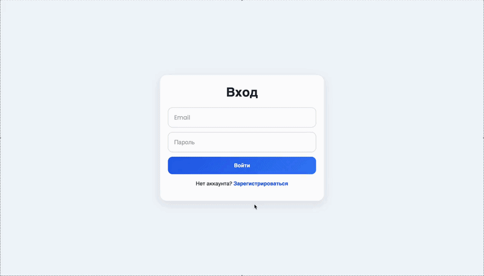

[](https://qlty.sh/gh/1ce1ceice/projects/task-manager)

# TaskManager

TaskManager — это веб-приложение для управления личными задачами. Пользователь может зарегистрироваться, войти в систему, создавать задачи, отмечать их как выполненные, удалять их и фильтровать список по статусу. За основу взят **Create Todoist clone with React and Firebase** из пет-проектов OpenSource.

## :question: Функции

- регистрация нового пользователя
- вход и выход из аккаунта
- защищенный доступ к dashboard
- создание задач
- отметка задачи как выполненной
- удаление задач
- фильтрация задач: все / активные / завершенные
- хранение данных в Firebase Firestore

## Архитектура

- **Frontend:** React + Vite  
- **Routing:** React Router  
- **Backend (BaaS):** Firebase  
- **Authentication:** Firebase Auth  
- **Database:** Firestore  
- **UI:** CSS
- **Deployment:** Firebase

## :exclamation: Установка

1. Клонировать репозиторий

```bash
git clone git@github.com:1ce1ceice/task-manager.git
cd task-manager 
```

2. Установить зависимости
```bash
npm install
```

3. Настроить Firebase

Создайте проект в Firebase Console и включите:
- Authentication → Email/Password
- Firestore Database

Создайте файл:
**src/lib/firebase.js**

И вставьте туда конфигурацию Firebase.

## Запуск
```bash
npm run dev
```
Приложение будет доступно по адресу:
http://localhost:5173

## :closed_lock_with_key: Test Account

- **Логин:** 123@mail.ru
- **Пароль:** 123123

## 🌍 Deployment

Live demo: https://task-manager-698f9.web.app

## Demo


    